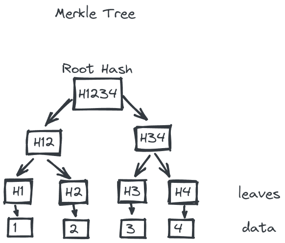

# Whitelist with Merkle Tree

<p align="center">
  
</p>

## Overview
This Solidity project demonstrates how to use a Merkle Tree data structure to implement a whitelist mechanism for a smart contract. Instead of storing addresses in storage memory, which can be expensive in terms of gas fees, this approach leverages the efficiency and security of Merkle Trees. <br>

Example of using Merkle Tree could be found in `test` folder. <br> Utility functions stored in `scripts` folder.

## Efficiency

### Storing `N` addresses
|      Method      | Total Gas Cost       |
| ---------------: | -------------------: |
|Without Merkle Tree| 20,000 * **N**  |
|With Merkle Tree  |     20,000 (const) |

### Verifying address
|      Method      | Total Gas Cost       |
| ---------------: | -------------------: |
|Without Merkle Tree|        2,518        |
|With Merkle Tree  |        4,652         |

## Getting Started
1. After cloning the project install the dependencies:
```bash
pnpm i
```

2. Run tests
```bash
npx hardhat test
```

